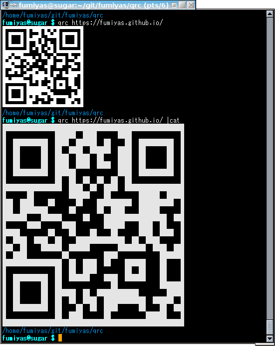

QR code generator for terminals
======================================================================

  * Copyright (C) 2014 SATOH Fumiyasu @ OSS Technology Corp., Japan
  * License: MIT License
  * URL: <https://github.com/fumiyas/qrc>
  * Home: <https://fumiyas.github.io/>

What's this?
---------------------------------------------------------------------

This program generates QR codes in
[ASCII art](http://en.wikipedia.org/wiki/ASCII_art) or
[Sixel](http://en.wikipedia.org/wiki/Sixel) format for
terminals, e.g., console, xterm, Windows command prompt and so on.

```console
$ qrc https://fumiyas.github.io/
...
```



Download
---------------------------------------------------------------------

Binary files are here for Linux, Mac OS X and Windows:

  https://github.com/fumiyas/qrc/releases

Build from source codes
---------------------------------------------------------------------

If you have Go language environment, try the following:

```console
$ go get github.com/fumiyas/qrc/cmd/qrc
```

