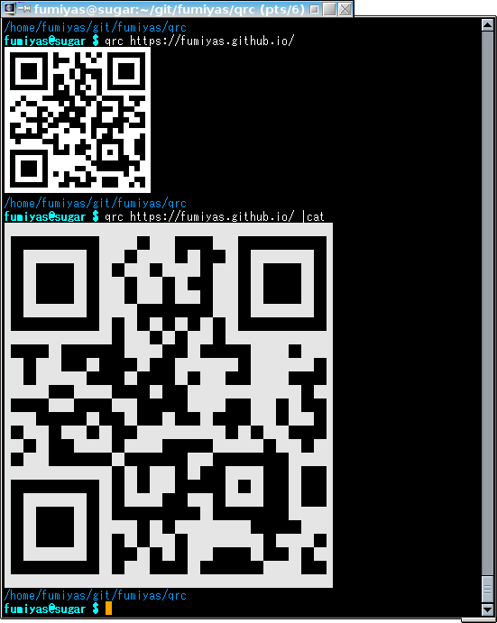

QR code generator for text terminals
======================================================================

  * Copyright (C) 2014-2026 SATOH Fumiyasu @ OSSTech Corp., Japan
  * License: MIT License
  * Development home: <https://github.com/fumiyas/qrc>
  * Author's home: <https://fumiyas.github.io/>

What's this?
---------------------------------------------------------------------

This program generates QR codes in
[ANSI colors](https://en.wikipedia.org/wiki/ANSI_escape_code#Colors),
[Sixel](http://en.wikipedia.org/wiki/Sixel) or
[Unicode Block Elements](https://en.wikipedia.org/wiki/Block_Elements)
format for
text terminals, e.g., console, xterm (with `-ti 340` option to enable Sixel),
[mlterm](http://sourceforge.net/projects/mlterm/),
Windows command prompt and so on.

Use case
---------------------------------------------------------------------

You can transfer data to smartphones with a QR code reader application
from your terminal.

Usage
---------------------------------------------------------------------

`qrc` program takes a text from command-line argument or standard
input (if no command-line argument) and encodes it to a QR code.

```console
$ qrc --help
...
$ qrc https://fumiyas.github.io/
...
$ qrc 'WIFI:S:Our-ssid;T:WPA;P:secret;;'
...
```

You can get a QR code in Sixel graphics if the standard output is
a terminal and it supports Sixel.



Download
---------------------------------------------------------------------

Binary files are here for Linux, macOS and Windows:

  * https://github.com/fumiyas/qrc/releases

Build from source codes
---------------------------------------------------------------------

Requires Go 1.21 or later.

Install the latest released version of `qrc` directly with `go install`:

```console
$ go install github.com/fumiyas/qrc/cmd/qrc@latest
```

Or, build from a local clone:

```console
$ git clone https://github.com/fumiyas/qrc.git
$ cd qrc
$ make build       # build the qrc binary in the working tree
$ make test        # run unit tests
$ make vet         # run go vet
$ make cross       # cross-compile for Linux, macOS and Windows
```

TODO
----------------------------------------------------------------------

  * Add the following options:
    * `--aa-color-scheme <ansi|windows>`
    * `--foreground-color R:G:B`
    * `--background-color R:G:B`
    * `--margin-color R:G:B`
  * Timeout for tty.GetDeviceAttributes1()

Contributors
----------------------------------------------------------------------

  * Hayaki Saito (@saitoha)

Similar products
----------------------------------------------------------------------

  * Go
    * <https://godoc.org/github.com/GeertJohan/go.qrt>
  * JavaScript (Node)
    * <https://github.com/gtanner/qrcode-terminal>
  * Ruby
    * <https://gist.github.com/saitoha/10483508> (qrcode-sixel)
    * <https://gist.github.com/fumiyas/10490722> (qrcode-sixel)
    * <https://github.com/fumiyas/home-commands/blob/master/qrcode-aa>
